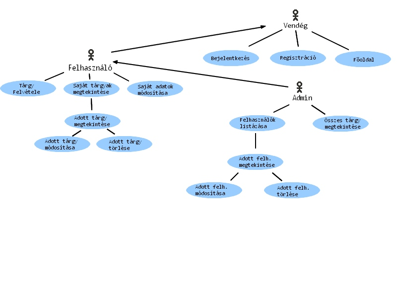
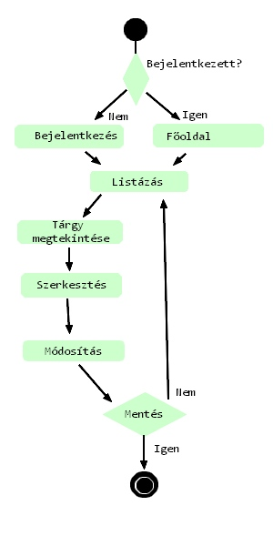
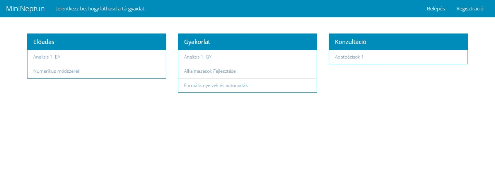
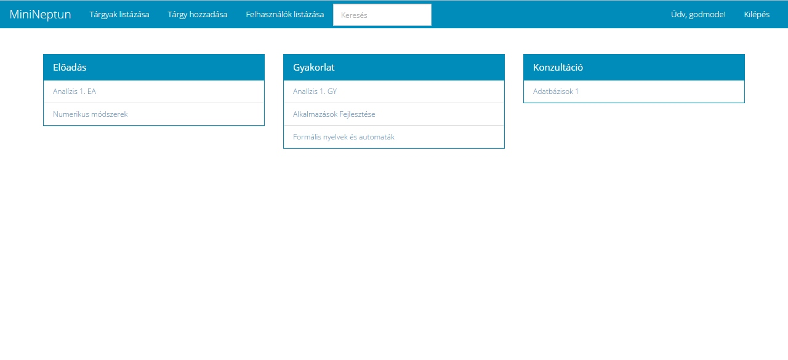
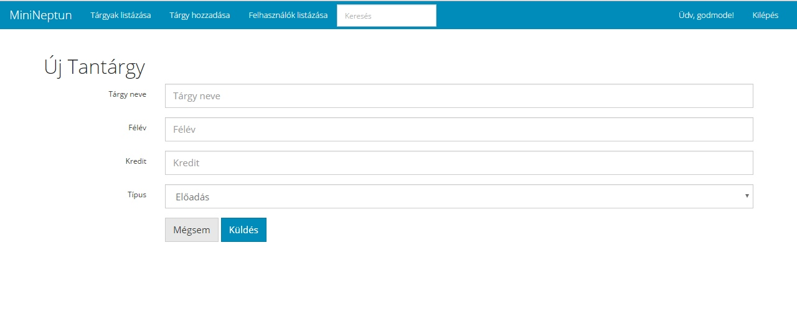
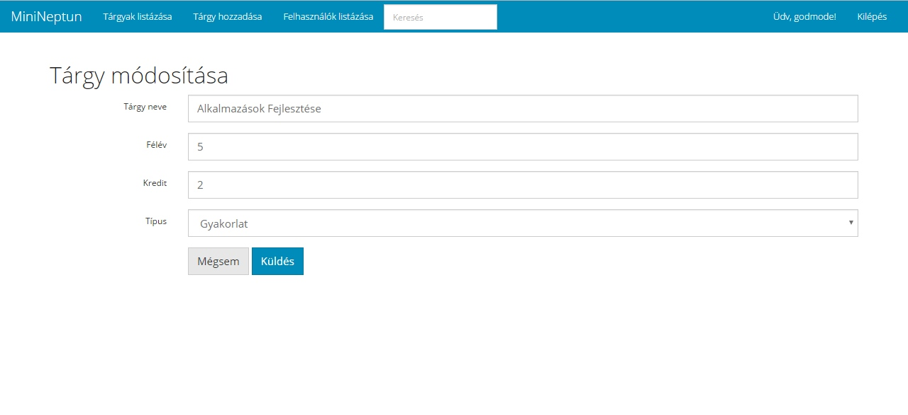
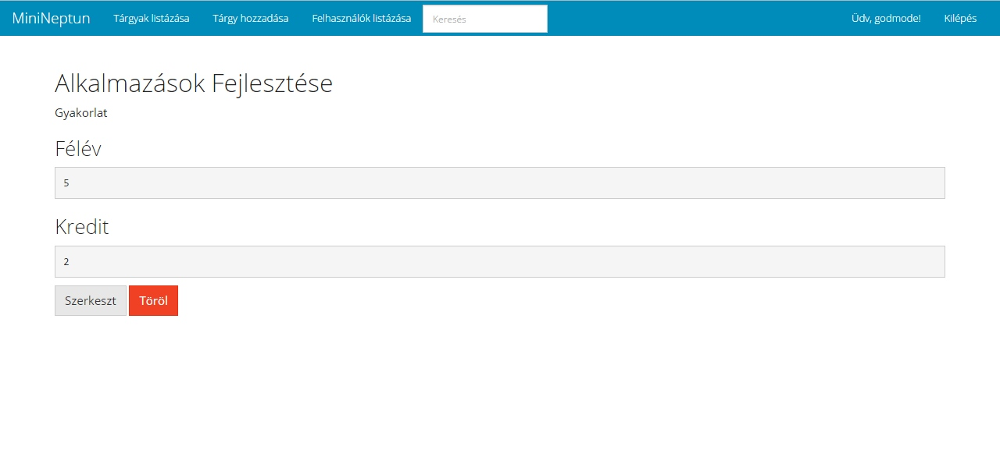
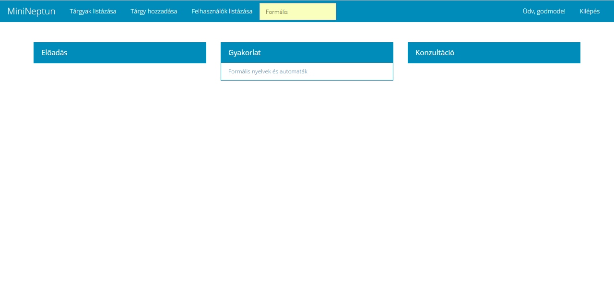

# Dokumentáció
Alkalmazások fejlésztese - Beadandó

# Tantárgyak felvétele (MiniNeptun)
 
## Funkcionális követelmények
 - vendégként csak a főoldal tekinthető meg, mely az oldal rövid leírását tartalmazza
 - a vendégnek lehetősége van bejelentkezni
 - bejelentkezés után van lehetőség tárgyakat felvenni
 - bejelentkezés után van lehetőség (már felvett) tárgyakat törölni
 - bejelentkezés után van lehetőség tárgyakat módosítani
 - van lehetőség kijelentkezni
 - van lehetőség saját adataid módosítására (godmode-ban minden felhasználó adatait)
 - van lehetőség godmode-ban listázni a felhasználókat
 
## Nem funkcionális követelmények
 - az oldal funckióinak megfelelő, felhasználóbarát kinézet
 - gyors, biztonságos működés

##### Használatieset-modell, funkcionális követelmények

**Vendég**: Csak a publikus oldalakat éri el

*	Főoldal
*	Bejelentkezés
*	Regisztráció

**Bejelentkezett felhasználó**: A publikus oldalak elérésén felül egyéb funkciókhoz is hozzáfér.

*	Új tárgy felvétele
*	Meglévő tárgyak megtekintése
*	Meglévő saját tárgyak szerkesztése
*	Meglévő saját tárgyak törlése
* Saját adatainak módosítása
* Kijelentkezés

**Egy példa az oldal használatára**:

**Meglévő recept szerkesztése:**

1.	A felhasználó az oldalra érkezve, bejelentkezik
2.	Bejelentkezés után megtekintheti a tárgyakat listázó oldalt, ahol kiválaszthatja a szerkeszteni kívánt tárgyat.
3.	Rákattint a tárgy nevére
4.	A megtekintés oldalon kiválaszthatja a „Szerkesztés” gombot
5.	Szerkesztés oldalon felviszi az új adatokat
6.	Submit gombra kattintva elmenti a változásokat

## Oldaltérkép

**Publikus:**
* Főoldal
* Bejelentkezés
* Regisztráció

**Bejelentkezett:**
* Főoldal
* Új tárgy felvétele
* Listaoldal (saját tárgyak) 
  * Tárgy megtekintése
    * Tárgy szerkesztése 
    * Tárgy törlése
* Saját adatok módosítása

**Admin:**
* Főoldal
* Új tárgy felvétele
* Listaoldal (összes tárgy) 
  * Tárgy megtekintése
    * Tárgy szerkesztése 
    * Tárgy törlése
* Listaoldal (összes felhasználó)
  * Felhasználó megtekintése
    * Felhasználó szerkesztése 
    * Felhasználó törlése
    
## Végpontok

### Bejelenzkezéssel kapcsolatos

* GET/: főoldal
* GET/login: bejelentkező oldal
* POST/login: bejelentkező adatok felküldése
* GET/register: regisztrációs oldal
* POST/register: regisztrációs adatok felküldése
* GET/logout: kijelentkező oldal

### Tárgyakkal kapcsolatos

* GET/ownSubjects: tárgyak listázása
* GET/subjects/create: új tárgy felvétele
* POST/subjects/create: új tárgy felvételéhez szükséges adatok felküldése
* GET/subjects/:id tárgy adatok
* GET/subjects/:id/delete tárgy törlése
* GET/subjects/:id/edit tárgy módosítása
* POST/subjects/:id/edit tárgy módosítása, adatok felküldése

### Felhasználókkal kapcsolatos

* GET/users/list: új felhasználó felvételéhez szükséges adatok felküldése
* GET/users/:id felhasználó adatok
* GET/users/:id/delete felhasználó törlése
* GET/users/:id/edit felhasználó módosítása
* POST/users/:id/edit felhasználó módosítása, adatok felküldése

##Megjelenés (bootswatch.com)

**Főoldal bejelentkezés nélkül**

**Főoldal bejelentkezés után**

**Tárgy hozzáadása**

**Tárgy szerkesztése**

**Tárgy megtekintése**

**Keresés**

##Adatbázisterv - Adatmodell

//db

##Implementáció

 ###Fejlesztő környezet: Visual Studio Code
  * Futtatás: terminál ablak nyitása (ctrl + ö) -> cd minineptun -> npm start
  * Használat: bármely böngészőben indítható a localhost:3333-on
  

##Könyvtárszerkezet
 
  A fejlesztés szempontjából lényeges könyvtárak, fájlok:
  
  * minineptun
   ** app **
    ** Http **
     ** Controllers **
      ** SubjectController **
      ** UserController **
